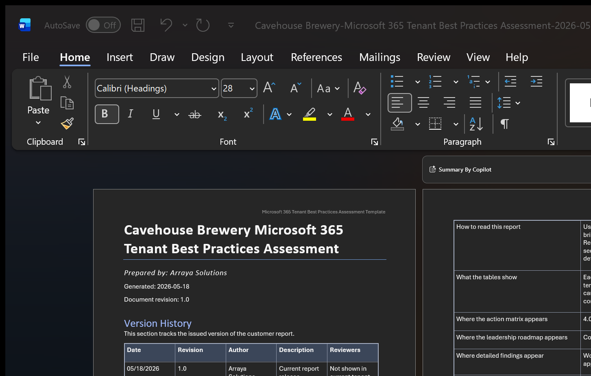
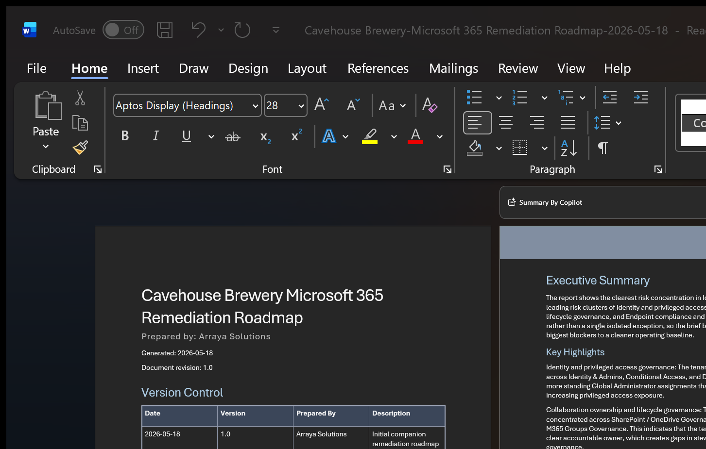

# Modern Workplace Tenant Assessment

Microsoft 365 tenant assessment tooling for consultants and engineers who need to collect tenant data, build customer-ready reports, and turn the findings into a practical remediation plan.

The main entry point is one PowerShell launcher. Run it without parameters when you want the guided menu:

```powershell
.\src\scripts\operations\Start-M365TenantAssessment.ps1
```

Most day-to-day runs start with the standard Microsoft 365 assessment:

```powershell
.\src\scripts\operations\Start-M365TenantAssessment.ps1 -Action Full
```

That standard run collects the tenant snapshot, generates customer deliverables, and builds the remediation outputs used by the engineer.

## When To Use This

Use this repo when you need to:

- Assess Microsoft 365 tenant configuration, security posture, collaboration settings, and governance signals.
- Produce customer-facing assessment and remediation documents.
- Save a reusable JSON snapshot for replay, comparison, or later reporting.
- Run preflight checks before a longer collection.
- Compare two assessment snapshots over time.

For the full operator guide, see [RUN.md](RUN.md).

## Quick Start

1. Install PowerShell 7 or later.
2. Install the Microsoft modules used by the assessment:

```powershell
.\tools\install-microsoft-modules.ps1
```

3. Start with a preflight check if this is a new tenant, new workstation, or new app registration:

```powershell
.\src\scripts\operations\Start-M365TenantAssessment.ps1 -Action Preflight
```

4. Run the assessment:

```powershell
.\src\scripts\operations\Start-M365TenantAssessment.ps1 -Action Full
```

If you prefer the guided flow, run the launcher with no `-Action` and choose from the menu.

## Common Actions

| Action | Use it when you want to |
| --- | --- |
| `Full` | Run the standard Microsoft 365 assessment and remediation workflow. |
| `Preflight` | Check authentication, connection, and permission readiness without collecting tenant data. |
| `Collect` | Collect the tenant snapshot only, so reporting can happen later. |
| `Report` | Generate reports from an existing snapshot. |
| `Improve` | Build remediation outputs from an existing snapshot or manifest. |
| `Compare` | Compare two saved tenant snapshots. |
| `AD` | Run the Active Directory assessment workflow. |

The older assessment-only behavior is still available:

```powershell
.\src\scripts\operations\Start-M365TenantAssessment.ps1 -Action Full -SkipImprove
```

## What It Assesses

A standard `Full` run collects data across six workload areas:

| Workload area | What is collected |
| --- | --- |
| Tenant Overview | Tenant details, license SKUs, AD Connect sync state |
| Identity | Users, admins, Entra groups, domains, authentication and SSO, federation, Conditional Access, MFA registration |
| Exchange | Mailboxes, recipients, groups, hybrid config, mail flow rules, public folders, email activity, governance |
| Collaboration | Unified groups, SharePoint and OneDrive sites, Teams inventory and voice |
| Endpoint | Devices, compliance state, device management rollup |
| Governance | Secure Score, Purview retention and DLP policies, external sharing, ownership gaps, license metadata |

## What a Run Looks Like

The launcher connects to each workload, then runs the collector. A typical console looks like this:

```text
  +========================================================+
  |       Arraya M365 Tenant Assessment Launcher           |
  +========================================================+

  ----------------------------------------------------------------
  [Connection]  Connection / Preflight
  ----------------------------------------------------------------

  Auth mode  :  Certificate
  -> Microsoft Graph...       Connected
  -> Exchange Online...       Connected
  -> Purview compliance...    Connected

  ----------------------------------------------------------------
  [1/6]  Tenant Overview
  ----------------------------------------------------------------

  [ 1/35 |  3%] Tenant overview           - Completed in 00:00:00
  [ 2/35 |  6%] License SKUs              - Completed in 00:00:00

  ----------------------------------------------------------------
  [2/6]  Identity
  ----------------------------------------------------------------

  [ 4/35 | 11%] Users                     - Completed in 00:00:05
  [ 5/35 | 14%] Admins                    - Completed in 00:00:02
  ...
  [35/35 |100%] Configuration summary tables - Completed in 00:00:00

  Assessment complete in 19 minute(s), 21 second(s)
  Customer report  : Deliverables\Contoso-Best Practices Assessment-2026-05-18.docx
  Roadmap report   : Deliverables\Contoso-Remediation Roadmap-2026-05-18.docx
  Engineer pack    : Deliverables\Contoso-EngPack.md
```

Runtime varies by tenant size. A typical run takes 15-25 minutes. Exchange mailbox enumeration is usually the longest step.

## What the Guidelines Check For

The improvement plan evaluates findings across eleven categories:

| Category | What gets flagged |
| --- | --- |
| Security posture | Secure Score gaps, unhardened baseline settings |
| Conditional Access | Report-only policies, missing device-compliance requirements, exclusion sprawl |
| MFA | Low registration rate, users without strong auth methods |
| Identity governance | Inactive guest accounts, high-privilege enterprise apps |
| Admin posture | Permanent privileged assignments, missing PIM coverage |
| Domain hygiene | Unverified domains, missing SPF/DKIM/DMARC records |
| Licensing | At-capacity SKUs, assignment errors |
| Devices | Unmanaged device population, unsupported OS versions |
| Exchange | Shared mailbox governance, external forwarding rules, growth risk |
| SharePoint / OneDrive | External sharing exposure, anonymous link defaults |
| Teams / Groups | Ungoverned Teams, ownership gaps, dormant groups |

Findings come from two sources: assessment-derived data built from collected tenant configuration, and heuristic rules in this repo. See [improvement-plan-rule-taxonomy.md](docs/runbooks/improvement-plan-rule-taxonomy.md) for detail on how to read and explain each finding.

## Authentication

The launcher supports three auth modes:

| Mode | Best for | Notes |
| --- | --- | --- |
| `Interactive` | Guided consultant runs | Default mode. Sign in when prompted. |
| `Certificate` | Repeatable app-based runs | Recommended for unattended or production-style execution. |
| `ClientSecret` | Compatibility cases | Graph app auth works, but some workloads fall back or are skipped. Prefer certificate auth when possible. |

Certificate example:

```powershell
.\src\scripts\operations\Start-M365TenantAssessment.ps1 `
  -Action Full `
  -AuthMode Certificate `
  -TenantId '<tenant-guid>' `
  -ClientId '<app-id>' `
  -CertificateThumbprint '<cert-thumbprint>'
```

Client secret example:

```powershell
$clientSecret = Read-Host 'Client secret' -AsSecureString

.\src\scripts\operations\Start-M365TenantAssessment.ps1 `
  -Action Full `
  -AuthMode ClientSecret `
  -TenantId '<tenant-guid>' `
  -ClientId '<app-id>' `
  -ClientSecretSecure $clientSecret
```

Setup references:

- [App Registration Setup](docs/runbooks/app-registration-setup.md)
- [Certificate Auth Setup](docs/runbooks/certificate-auth-setup.md)

> **Automated app registration setup** -- a guided script to create and configure the Entra app registration is in development. Until it is available, follow the manual steps in the runbooks above.

## Output Profiles

Profiles tune how much data is collected and which deliverables are created.

| Profile | Best for |
| --- | --- |
| `SolutionsEngineer` | Standard consultant run and the default choice for most assessments. |
| `ExecutiveLevel` | Leadership-friendly summary depth. |
| `Presales` | Lighter discovery and presales posture review. |
| `TenantToTenantMigration` | Deep migration readiness and cutover planning. |
| `Geek` | Detailed engineer troubleshooting. |
| `Machine` | JSON-first automation, replay, and downstream processing. |

You can request more than one profile in a single run:

```powershell
.\src\scripts\operations\Start-M365TenantAssessment.ps1 `
  -Action Full `
  -OutputProfile SolutionsEngineer,ExecutiveLevel
```

## What Gets Created

A standard `Full` run writes the main working files into two folders.

`Deliverables` contains the files you are most likely to share or review first:

- `*-Best Practices Assessment-*.docx` -- 15-section Word document covering each workload area with an executive summary, per-section recommendations, and configuration evidence tables. Ready to share with the customer.
- `*-Remediation Roadmap-*.docx` -- Phased action plan (0-30, 31-60, 61-90 days) distilled from the findings. Suitable for leadership review and project scheduling.
- `*-EngPack.md` -- Engineer action pack with raw finding rows, evidence references, supporting PowerShell snippets, and links to the snapshot for replay.
- `*.xlsx` when the selected profile enables workbook output

`Support` contains the machine-readable and troubleshooting artifacts:

- `*-AssessmentSnapshot.json` -- Full tenant data snapshot. Use with `-Action Report`, `Improve`, or `Compare` to regenerate or diff without reconnecting to the tenant.
- `*-Plan.json` -- Structured finding rows (severity, area, current and target values, remediation guidance). Use for automation, filtering, or downstream processing.
- `*-Snips.ps1` -- Ready-to-run PowerShell snippets for common remediation tasks surfaced by the findings.
- `*-SolutionsEngineerEvidenceCoverage.json` -- Evidence coverage map used to verify collector completeness.
- `*.manifest.json`
- `Debugging\*`

By default, outputs are written under:

```text
%LOCALAPPDATA%\Arraya\M365TenantAssessment\Outputs
```

Pass `-ExportPath` when you want to choose the output folder:

```powershell
.\src\scripts\operations\Start-M365TenantAssessment.ps1 `
  -Action Full `
  -ExportPath 'C:\Assessment-Outputs'
```

### Sample outputs


*Customer-facing Best Practices Assessment report*


*Phased Remediation Roadmap*

## Helpful Runbooks

- [RUN.md](RUN.md)
- [Customer Execution Checklist](docs/runbooks/customer-execution-checklist.md)
- [App Registration Setup](docs/runbooks/app-registration-setup.md)
- [Certificate Auth Setup](docs/runbooks/certificate-auth-setup.md)
- [Improvement Plan Rule Taxonomy](docs/runbooks/improvement-plan-rule-taxonomy.md)

## Development

Install the maintainer tooling:

```powershell
.\tools\install-microsoft-modules.ps1 -IncludeDevTools
```

Run the usual validation checks:

```powershell
.\tools\invoke-scriptanalyzer.ps1
.\tools\run-pester.ps1
```

**Architecture direction:** The assessment is transitioning from a single large legacy script (`Get-FullTenantReportDetails.ps1`) toward a module-based structure under `src/modules/`. New collection logic is added as module functions; the legacy script remains the orchestration layer while the migration is in progress.
